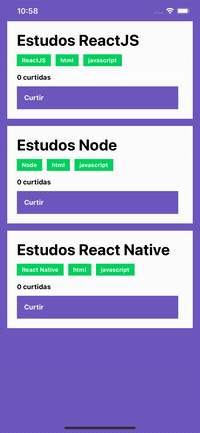

<h3 align="center">
  Challenge 04: React Native Concepts
</h3>

  

### 🚀 About the challenge

In this challenge, an application was created to practice what I learned in React Native.

The application has the purpose of storing repositories, which will allow you to list and like repositories.

### Application Features

List the repositories for your API: You should be able to create a list with the title field of all the repositories that are registered in your API.

Adding a repository to your API: You should be able to like an item to your API using a button with the text 'Curtir' and, after creation, you should be able to display its number of likes after registration.

### Tests Specification

- **`should add a like to the like counter of the repository`**: For this test to pass, your application must allow a repository to be liked to your backend and listed on your frontend.

### 📱 App preview

---

Made with ❤️ by morikawa77
